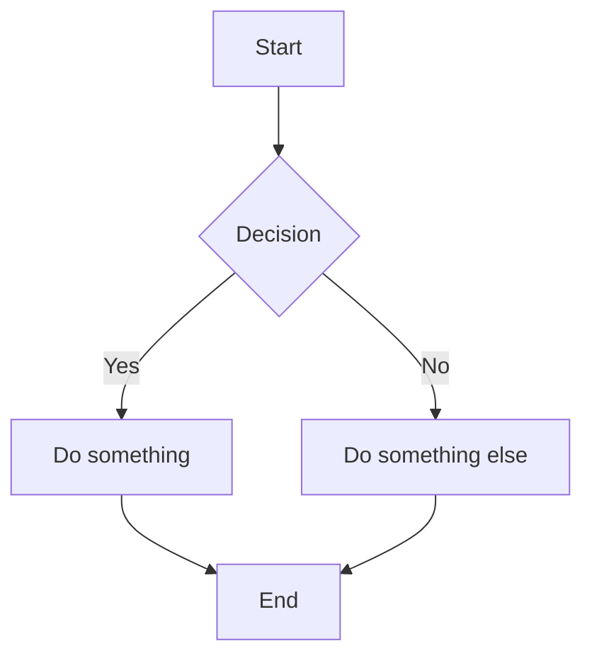

## Welcome

This is a test post for the blog. Everything seems to be working correctly!

### Code Example

```typescript
const greeting = "Hello, World!";
console.log(greeting);
```

```rust
fn main() {
    println!("Hello, World!");
}
```



### List

- Item 1
- Item 2
- Item 3

Thanks for reading.
